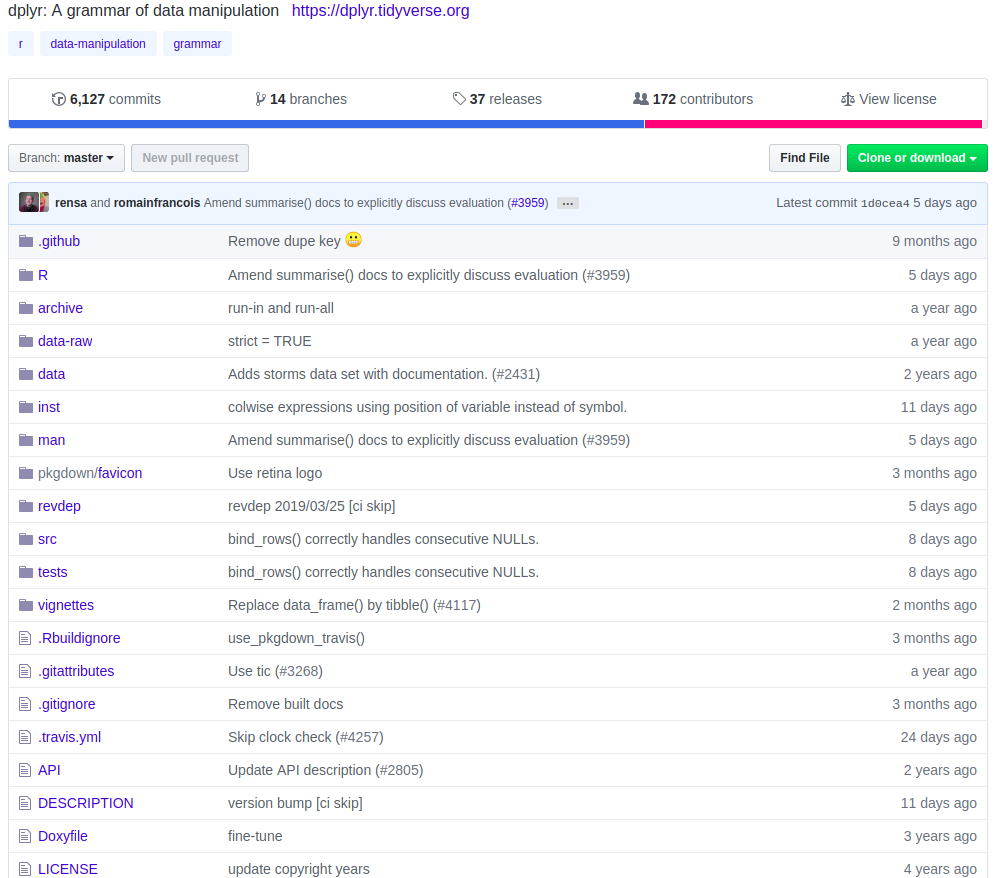

```{r setup, include=FALSE}
knitr::opts_chunk$set(echo = FALSE)
```

## Presentacion

- @pdelboca
- Ingeniero en Sistemas de Información y entusiasta de los datos
- Desarrollador Python en Datopian
- Presidente de Open Data Córdoba

## Agenda

- ¿Qué es un paquete?
- Estructura de un Paquete
- Componentes más importantes
- Armando un Paquete para acceder a APIs
- Mejores Prácticas
- Beneficios

## ¿Qué es un paquete?

Los paquetes son las unidades fundamentales de código R reproducible. Incluyen **funciones** de R *reutilizables*, la **documentación** que describe cómo usarlas y **datos** de muestra.

## ¿Qué es un paquete?

En R, la unidad fundamental del código compartible es el paquete. Un paquete agrupa código, datos, documentación, pruebas, y es fácil de compartir con otros.

## ¿Qué es un paquete?

Mostrar código, datos, documentacion, tests.



## ¿Qué es un paquete?

A source package is just a directory with components like R/, DESCRIPTION, and so on.

## Beneficios

> “Seriously, it doesn’t have to be about sharing your code (although that is an added benefit!). It is about saving yourself time. (Hilary Parker)” 

Organizar el código en un paquete facilita su vida porque los paquetes vienen con convenciones. Por ejemplo, pones el código R en **R/**, pruebas en **tests/** y datos en **data/**.

## Beneficios


## R/

El primer principio para crear un paquete es que todo el código R va en **R/**.

El código R en los paquetes tiene el objetivo de crear objetos (mayoritariamente funciones).

## R/

When you load a script with source(), every line of code is executed and the results are immediately made available. Things are different in a package, because it is loaded in two steps. When the package is built (e.g. by CRAN) all the code in R/ is executed and the results are saved. When you load a package, with library() or require(), the cached results are made available to you. If you loaded scripts in the same way as packages, your code would look like this:

```{r, eval = FALSE, echo = TRUE}
# Load a script into a new environment and save it
env <- new.env(parent = emptyenv())
source("my-script.R", local = env)
save(envir = env, "my-script.Rdata")

# Later, in another R session
load("my-script.Rdata")
```


## Buenas Practicas

The main difference between library() and require() is what happens if a package isn’t found. While library() throws an error, require() prints a warning message and returns FALSE. In practice, this distinction isn’t important because when building a package you should **NEVER** use either inside a package. See package dependencies for what you should do instead.

No usar funciones que agreguen objetos al entorno de trabajo: No usar library o require, No usar source.


## DESCRIPTION

Usado para guardar Metadata del paquete

```{r, eval=FALSE}
Package: mypackage
Title: What The Package Does (one line, title case required)
Version: 0.1
Authors@R: person("First", "Last", email = "first.last@example.com",
                  role = c("aut", "cre"))
Description: What the package does (one paragraph)
Depends: R (>= 3.1.0)
License: What license is it under?
LazyData: true
```

## DESCRIPTION

Imports: packages listed here must be present for your package to work. In fact, any time your package is installed, those packages will, if not already present, **be installed on your computer** (devtools::load_all() also checks that the packages are installed).

Adding a package dependency here ensures that it’ll be installed. However, it does not mean that it will be attached along with your package (i.e., library(x)). The **best practice** is to explicitly refer to external functions using the syntax package::function(). This makes it very easy to identify which functions live outside of your package. This is especially useful when you read your code in the future.

## DESCRIPTION
Suggests: your package can use these packages, but doesn’t require them. You might use suggested packages for example datasets, to run tests, build vignettes, or maybe there’s only one function that needs the package.

Packages listed in Suggests are not automatically installed along with your package. This means that you need to check if the package is available before using it (use requireNamespace(x, quietly = TRUE)). There are two basic scenarios:

```{r, eval = FALSE}
# You need the suggested package for this function    
my_fun <- function(a, b) {
  if (!requireNamespace("pkg", quietly = TRUE)) {
    stop("Package \"pkg\" needed for this function to work. Please install it.",
      call. = FALSE)
  }
}

# There's a fallback method if the package isn't available
my_fun <- function(a, b) {
  if (requireNamespace("pkg", quietly = TRUE)) {
    pkg::f()
  } else {
    g()
  }
}
```

## DESCRIPTION
Versionado de Paquetes
```{r, eval=FALSE}
Imports:
    ggvis (>= 0.2),
    dplyr (>= 0.3.0.1)
Suggests:
    MASS (>= 7.3.0)
```

Salvo excepcion concreta, nunca ==, siempre >=.

## data/
The most common location for package data is (surprise!) data/. Each file in this directory should be a .RData file created by save() containing a single object (with the same name as the file). The easiest way to adhere to these rules is to use devtools::use_data():

```{r, eval=FALSE}
x <- sample(1000)
devtools::use_data(x, mtcars)
```

## data/
If the DESCRIPTION contains LazyData: true, then datasets will be lazily loaded. This means that they won’t occupy any memory until you use them.

I recommend that you always include LazyData: true in your DESCRIPTION. devtools::create() does this for you.

## data/

Sometimes functions need pre-computed data tables. If you put these in data/ they’ll also be available to package users, which is not appropriate. Instead, you can save them in R/sysdata.rda. For example, two colour-related packages, munsell and dichromat, use R/sysdata.rda to store large tables of colour data.

You can use `r devtools::use_data()` to create this file with the argument `r internal = TRUE`:

```{r}
x <- sample(1000)
devtools::use_data(x, mtcars, internal = TRUE)
```

## data-raw/
Often, the data you include in data/ is a cleaned up version of raw data you’ve gathered from elsewhere. I highly recommend taking the time to include the code used to do this in the source version of your package. This will make it easy for you to update or reproduce your version of the data. I suggest that you put this code in data-raw/. **You don’t need it in the bundled version of your package, so also add it to .Rbuildignore.** 

